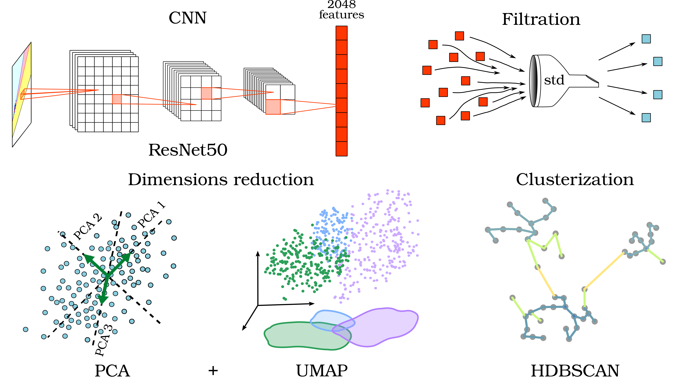
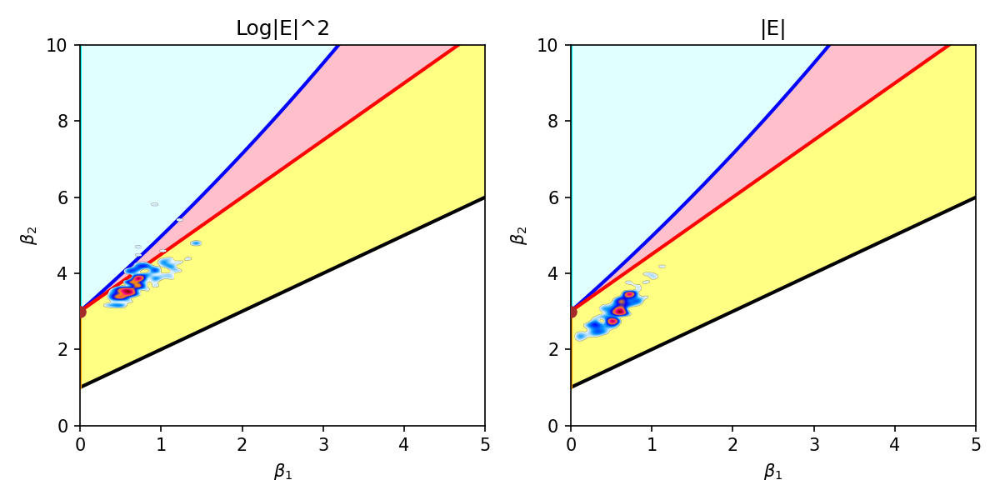
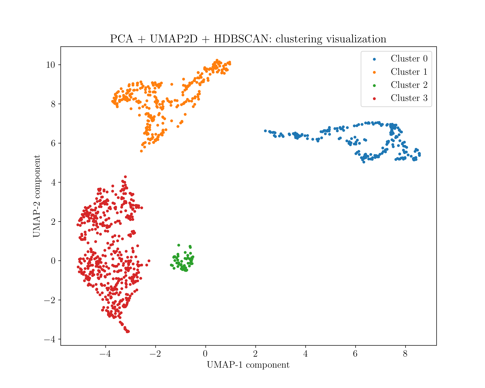

# Classification of Statistical Pearson diagrams

**Problem**: There is a set of typical statistical diagrams. How to sort them fast and automatically?

Image processing:
1. Feature extraction from an image by pretrained CNN [ResNet50](https://openaccess.thecvf.com/content_cvpr_2016/html/He_Deep_Residual_Learning_CVPR_2016_paper.html) without the last layer 
2. Filtration of low informative features
3. Smooth reduction of feature space dimension: PCA + UMAP
4. Clustering and sorting images by HDBSCAN

Dependencies: 

Python modules
- [torch, torchvision](https://pytorch.org/get-started/locally/)
- [sklearn](https://scikit-learn.org/stable/install.html#installation-instructions)
- [umap](https://umap-learn.readthedocs.io/en/latest/)
- [hdbscan](https://pypi.org/project/hdbscan/)
- pandas, numpy
- tqdm (progress bar)
- matplotlib, seaborn

Pearson diagrams are obtained from Solar Orbiter RPW-TDS data. 
For more details see

*V.Annenkov, C.Krafft, A.Volokitin, and P.Savoini* 
*Statistical properties of beam-driven upper-hybrid wave turbulence in the solar wind*, submitted to **A&A**

The example of a diargam is below.

The example of results:

