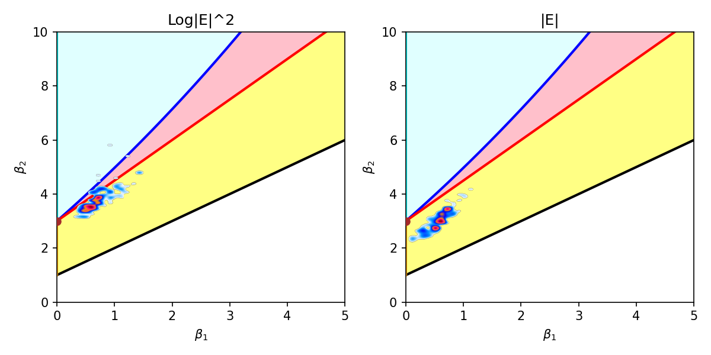
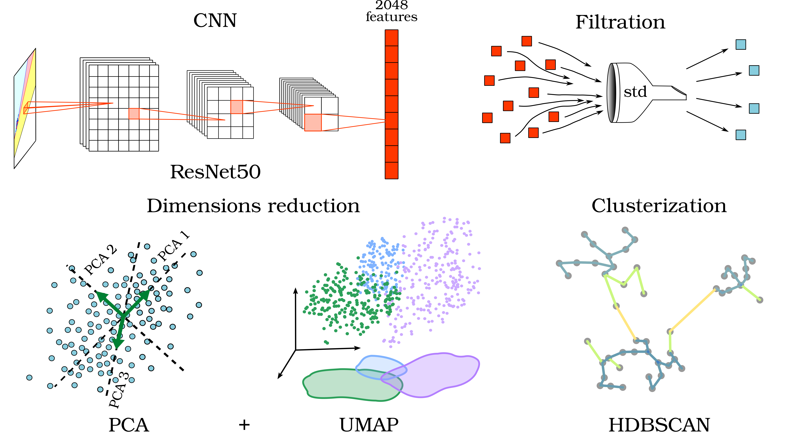
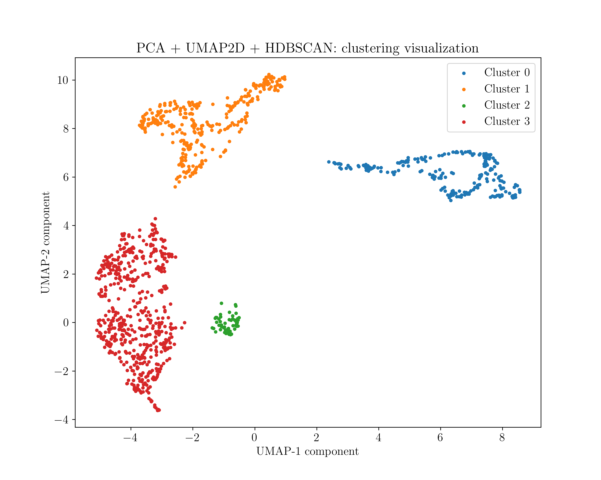
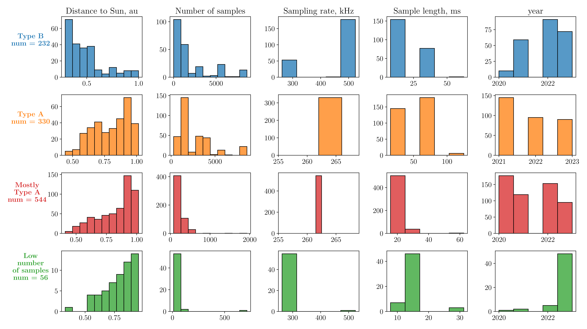

# Classification of Statistical Pearson diagrams


## About

The project is designed for automatic classification of statistical diagrams obtained from plasma turbulence measurement data by Solar Orbiter (RPW-TDS instruments). For details on the physical formulation of the problem, obtaining and analyzing diagrams, see 
[*Statistical properties of beam-driven upper-hybrid wave turbulence in the solar wind*, accepted to **V. Annenkov, C. Krafft, A. Volokitin and P. Savoini A&A, 699 (2025)**](https://doi.org/10.1051/0004-6361/202555087). 


## Features of the Project

For an example of typical Pearson charts that need to be classified, see below and in the folder `./images/images_regular_data/`.

<p align="center">

</p>

**The problem**: a set of more than 2 thousand statistical diagram images must be classified and analysed. No labeled training data is available.

Image processing:
1. Features extraction from an image by pretrained CNN [ResNet50](https://openaccess.thecvf.com/content_cvpr_2016/html/He_Deep_Residual_Learning_CVPR_2016_paper.html), without classification head;
2. Filtering of low-informative features;
3. Smooth reduction of features space dimension: PCA + UMAP;
4. Clustering and sorting images by HDBSCAN;

<p align="center">

</p>

The project implements the ability to manually construct a pipeline based on any (reasonable) combination of standardization methods (StandardScaler, Normalizer - sci-kit learn library) and dimension reduction methods (UMAP, PCA). 
For comparison, clustering methods like DBSCAN and KMeans are also supported.
To evaluate unsupervised clustering, Silhouette score and Davies Bouldin score are used.
To evaluate cluster stability, Adjusted Rand score is used.

The interactive mode (run `main_interactive.py`) allows you to select a combination of models and their parameters "on the fly".

<p align="center">

</p>

Cluster labels are stored in a resulted DataFrame along with image paths.

## Results

The example of clustered data obtained by a standard algorithm: ResNet without a last layer + PCA(with 0.95 dispersion threshold) + UMAP 2D + HDBSCAN, -  is below.

<p align="center">

</p>

Histograms for clusters in the dependence on parameters of measurements:

<p align="center">

</p>

## Stability and grid search

To assess the (local) stability of a clustering, for each point we compute the fraction (exact when comparing two runs, or averaged over many runs) of its k nearest neighbors
that remain in the same cluster as the point itself. We refer to this measure as neighborhood preservation, or intra-cluster stability. To assess the global stability of clustering between two runs,
we use the adjusted Rand index (ARI; Hubert & Arabie; 1985), which quantifies the agreement between two partitions based on the proportion of point pairs assigned consistently (either to the
same cluster or to different clusters) in both. Corrected for the agreement expected by chance, it yields a value of 1 for a perfect match and 0 for agreement at the level of random labeling.

Functions for stability, ARI and grid search are in clusterlib. The example of use is in `main_stability.py`. 
Pipeline there is
- Load raw features from a pickle file.
- Drop doubled events listed in a text file.
- Variance filter -> remove near-constant features.
- Correlation filter -> remove redundant features.
- PCA -> reduce to 95 % explained variance.
- Reference clustering (fixed params from hdbscan_tests.py).
- Grid stability sweep (wide UMAP x HDBSCAN grid, k = 15).
- Save / load results (.npz via clusterlib.io).
- 2D UMAP embedding for visualisation.
- Two-panel figure: neighbourhood preservation + agreement with reference,
both rendered with kernel-smoothed interpolation (interpolation2 style).

Below are the examples.


## Structure
### Contents

The main part of the project responsible for data processing is packaged in the `mclustering` module. An example of using the module is given in `main.py`. The `manalyse` module is used to visualize the results, an example of using `main_plot.py`.

The `minteractive` module implements interactive (from the console) launch of processing, guiding through the entire process, with the ability to select a specific pipeline. An example of use is presented in `main_interactive.py`, (is in progress)

```
project
├── main.py # Basic pipeline
├── main_interactive.py # Interactive processing
├── main_plot.py # Visualization
├── main_stability # Stability study
├── README.md
├── LICENSE
├── mlustering # The main module for proccessing
|   ├── __init__.py
|   ├── libfeatures.py # Feature extraction
|   ├── libprepocessing.py # Dimension reduction by PCA and UMAP
|   ├── libclustering.py # Clustering, clusters visualization and evaluation
|   ├── libservice.py # Supplementary functions
├── minteractive # Interactive module
|   ├── __init__.py
|   ├── libintercative.py # Supplementary functions for input/output
|   ├──libprocesspipeline.py # Automatical launch of the process
├── manalyse
|   ├── __init__.py
|   ├── plot_funcs.py # Functions for visualization
├── clusterlib
|   ├── __init__.py
|   ├── clustering.py # UMAP+HDBSCAN pipeline, parameter utilities, HDBSCAN diagnostics
|   ├── gradcam.py # Grad-CAM visualisation for cluster medoids (requires torch + cv2)
|   ├── io.py # Save/load .npz for stability, bootstrap, grid search results
|   ├── metrics.py # Embedding quality: space preservation, MST metrics, TDA
|   ├── pareto.py # Pareto front computation and CSV/Parquet I/O
|   ├── preprocessing.py # Feature selection: variance filter, correlation removal
|   ├── stability.py # Stability metrics: ARI, neighbourhood preservation, bootstrap, seed
|   ├── visualization.py # Plots: stability contour maps, ARI boxplots, cluster scatter
```
### Inputs

`images` folder is for source images to be analysed. The source images are supposed to be placed in a separate subfolder with name starting with 'images_'. 

`data` folder is supposed to contain a metadata-file describing the images.

```
├── images # source images
|   ├── images_regular
├── data # for metadata, data description

```

### Outputs
Results are supposed to be saved as
- .pkl or .json file for a resulted database with labels - `results` folder
- subdirectory in `processed` folder named as 'processed_{specification as for images folder}'; images are sorted in there in different subdirectories according their label: 'label_0', 'label_1, ... 'noise'
- Visual data .pdf/.png should be saved in `figures` folder.

```
├── results # .pkl/.json resulted database
├── processed
|   ├── processed_regular
|   |   ├── label_0 # for sorted images with label 0
|   |   ├── label_1 # for sorted images with label 1
├── figures # for visual results
```
### Other

`documentation` folder is for .html/.pdf documentation. The documentation is generated semi-automatically with [Pdoc](https://pdoc.dev/).

`logs` - a folder for full logs per run.

## Dependencies 

- Python 3.8+
- [torch, torchvision](https://pytorch.org/get-started/locally/)
- [sklearn](https://scikit-learn.org/stable/install.html#installation-instructions)
- [umap](https://umap-learn.readthedocs.io/en/latest/)
- [hdbscan](https://pypi.org/project/hdbscan/)
- pandas, numpy
- tqdm (progress bar)
- matplotlib, seaborn
- logging
- typing (signatures)
- shutil (copying files)
- PIL
- cv2 (gradcam)

## Cite this

Volchok, E. (2026). epvolchok/pearson-diagram-classification: v1.0 (v1.0). Zenodo. https://doi.org/10.5281/zenodo.20176405
